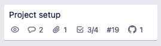

# Trello Link GitHub Action

View on the [GitHub Marketplace](https://github.com/marketplace/actions/trello-link-github-action)

Trello has a [Power-Up to link GitHub commits, pull requests, branches, or issues to a card](https://trello.com/power-ups/55a5d916446f517774210004/github), however, this must be done manually. This action allows you to link a commit, pull request, or issue to a Trello card automatically by using Trello's short Id in a commit message, pull request title or body, or issue title or body.

## Usage

### GitHub Repository Action

In your repository, create an action workflow with the following step:

```yaml
- name: Link to Trello
  uses: kagof/trello-link-github-action@v1.0.0
  with:
    # Optional if allow-missing-board is true. Required otherwise.
    # Allowed to be one of the following:
    # 1. the board name
    # 2. the board shortLink (can be found in the URL)
    # 3. the boardId (can be found via the Trello REST API)
    board-identifier: "${{ secrets.BOARD_IDENTIFIER }}"
    # Optional (default false)
    # If this is true and the board-identifier is missing or cannot be resolved,
    # the Action will search across all of your boards.
    allow-missing-board: 'false'
    # Required
    # Secret token used to contact Trello
    trello-token: "${{ secrets.TRELLO_TOKEN }}"
    # Optional (default 'TRELLO-')
    # When preceding a number in a commit message or PR body or title,
    # indicates that the number is a Trello shortId.
    # May be either:
    # 1. an alpha string, eg TRELLO
    # 2. an alpha string followed by a dash, eg TRELLO-
    # 3. one of the characters ! @ # $ % ^ & * + = (note: must be exactly 1 char long)
    marker: 'TRELLO-'
```

This action may be triggered on commits, pull requests, or issues.

#### Token

A Trello token is required for this action. To generate it, visit https://trello.com/1/authorize?response_type=token&scope=read,write&name=Trello+Link+GitHub+Action+Token&expiration=never&key=09045f0c83d151e8d48ec9feb99e78ae in your browser, or adjust the name and expiration parameters in this URL to your liking.

**KEEP THIS TOKEN SECRET**. It can be used to change or read data on any of the Trello boards you have access to. You should add it as a secret in your repository.

You may revoke this token at any time from your account settings page in Trello.

### Trello Board

In your Trello board, it is recommended that you add the following Power-Ups:

1. [Card Numbers by Reenhanced](https://trello.com/power-ups/59c3d177178a761767b49278/card-numbers-by-reenhanced) - this lets you easily see the Trello card's shortId.
2. [GitHub](https://trello.com/power-ups/55a5d916446f517774210004/github) - this completes the integration with Trello

After doing so and properly configuring them, your cards will look something like this:



Note the `#19` - this is the Trello shortId for this card.

### Commits, Pull Requests, and Issues

When opening commits, put your marker and ticket short number anywhere in the commit message. When opening pull requests or issues, place it anywhere in your title or body.

As long as there is a word break, your tag will be picked up. If your marker is a special character, the word break is not necessary. Multiple tags are allowed.

For Example, if your marker is `TRELLO-`:

#### Valid

* `TRELLO-19 fixes that problem`
* `TRELLO-19: fixes that problem`
* `fixes TRELLO-19 and TRELLO-18`
* `fix/TRELLO-19-fix-the-stuff`
* `TRELLO-19,TRELLO-18`

#### Invalid

* `fixTRELLO-19`
* `TRELLO-19fixes`

## Known Shortcomings

* If this action runs on a pull request, the commits in the PR are not considered during the run. This can be worked around by running the action on commits as well.
* Branch are not (yet?) considered
* If you want to use the long ID of a card (or anything other than the shortId), that is not (yet?) supported
